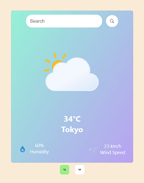

# Weather Card Application

A minimal aesthetic weather card component made with HTML, CSS, Javascript and bundled with Webpack for optimal performance. Designed with [SOLID OOP](https://en.wikipedia.org/wiki/SOLID) principles in mind. 

## Features 

- Displays current real time weather data across the globe
- Switch between Celsius (metric) and Fahrenheit (imperial) units
- Quickly query data for capital cities by quering the countries/state instead

[Live App](https://u-idaniel.github.io/weather-card/)

## Credits

<a target="_blank" href="https://icons8.com/icon/132/search" rel="noopener noreferrer">Search</a> icon by <a target="_blank" href="https://icons8.com" rel="noopener noreferrer">Icons8</a>

Animated Weather Icons by <a href="https://github.com/basmilius/weather-icons/tree/dev?tab=readme-ov-file" target="_blank" rel="noopener noreferrer">basmilius</a>

Card design was inspired by [GreatStack](https://www.youtube.com/watch?v=MIYQR-Ybrn4)